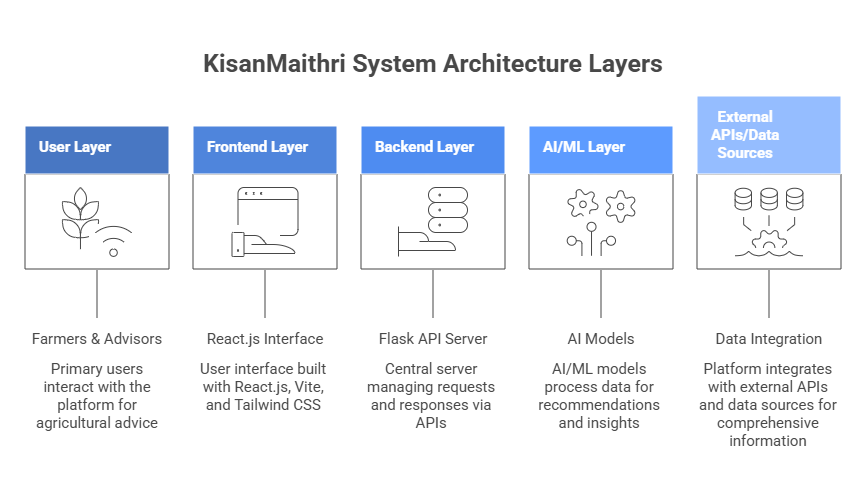
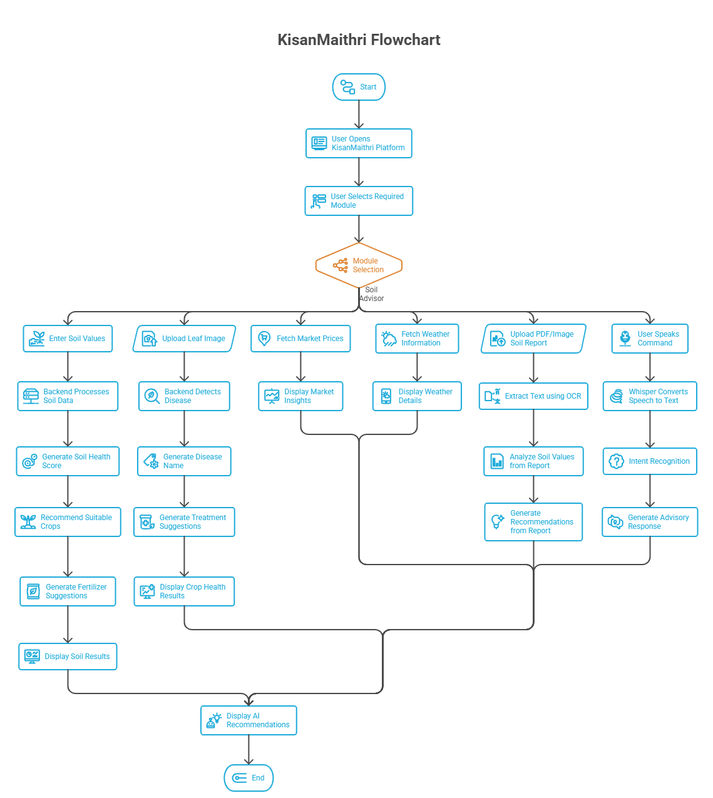
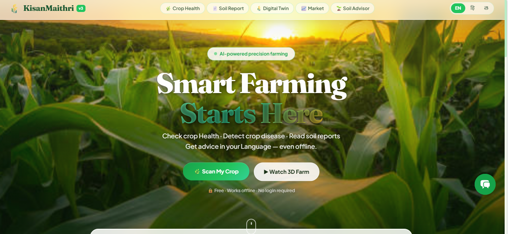
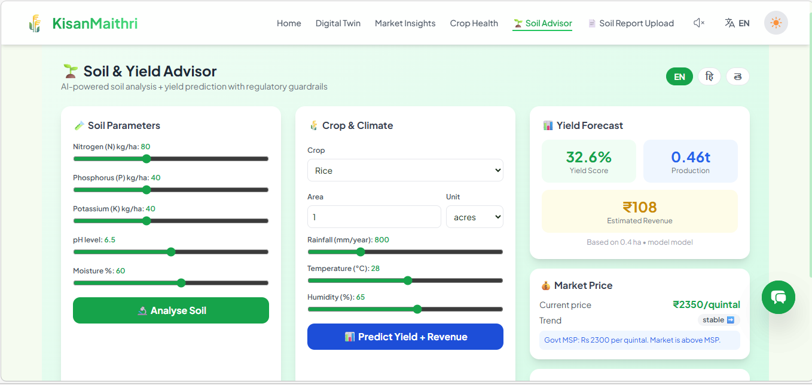

# 🌾 KisanMaithri Enhanced v2.0
### Agricultural Advisory Agent — Multi-modal | Offline-capable | Regulatory-compliant

> **Problem Statement:** Build a domain-specific AI agent for agriculture that executes domain workflows, handles edge cases properly, and stays within regulatory and policy guardrails — working with multi-modal inputs (soil data, weather, market prices, voice in local languages) to deliver actionable guidance to farmers, even in low-connectivity environments.

---

## 🆕 What's New in v2.0

| Feature | v1 (Original) | v2 (Enhanced) |
|---------|--------------|----------------|
| Speech-to-Text | Browser Web Speech API only (online) | **Whisper offline STT** — works without internet |
| Advisory LLM | Ollama (disabled in production) | **Llama 3.1 8B via llama-cpp** — runs on CPU offline |
| Disease Detection | 4-class custom CNN (Tomato only) | **38-class PlantVillage VGG13** (14 crops) |
| Yield Prediction | Random numbers | **Real ML model** (N/P/K/pH/temp/humidity/rainfall) |
| Soil Analysis | None | **Full soil agent** with fertilizer scheduling |
| Market Prices | Static mock data | **Live + offline cache** with MSP comparison |
| Weather | None | **Live Open-Meteo API** with 1-hour offline cache |
| Regulatory Guardrails | None | **Banned pesticide check + MSP alerts + govt schemes** |
| Offline Fallback | App crashes | **Graceful degradation** — works without internet |

---

## 🏗 Architecture

```
┌─────────────────────────────────────────────────────────────┐
│                    KisanMaithri Enhanced                         │
├──────────────────────────┬──────────────────────────────────┤
│   FRONTEND (React/Vite)  │      BACKEND (Flask/Python)      │
│                          │                                   │
│  VoiceControl            │  /transcribe  ← Whisper STT      │
│   ├── Whisper (offline)  │  /get-advice  ← Llama 3.1 8B    │
│   └── Web Speech API     │  /detect      ← VGG13 38-class   │
│                          │  /predict-yield ← ML yield model  │
│  FloatingAssistant       │  /soil-analysis ← Soil agent     │
│   ├── Chat UI            │  /weather     ← Open-Meteo API   │
│   ├── Voice input        │  /market      ← Price data       │
│   └── Guardrail alerts   │  /guardrails-check               │
│                          │                                   │
│  SoilAdvisor page        │  Regulatory Guardrails:           │
│   ├── Soil sliders       │   • Banned pesticide check        │
│   ├── Yield predictor    │   • MSP (Min Support Price) info  │
│   ├── Weather widget     │   • Govt scheme alerts            │
│   └── Market prices      │   • KVK referral for edge cases   │
└──────────────────────────┴──────────────────────────────────┘
```
---

---
## Flow of Our Project


---

## 📦 Models Used

### Model 1 — Disease Detection (38-class PlantVillage VGG13)
- **Repo:** [MarkoArsenovic/DeepLearning_PlantDiseases](https://github.com/MarkoArsenovic/DeepLearning_PlantDiseases)
- **Dataset:** PlantVillage — 54,000+ images, 14 crops, 38 disease classes
- **Fallback:** Original 4-class Tomato CNN (`model_saved/`) if VGG13 not downloaded

### Model 2 — Offline STT (OpenAI Whisper base)
- **Repo:** [openai/whisper](https://github.com/openai/whisper)
- **Size:** 74MB, supports Telugu + Hindi + English out of the box
- **Install:** `pip install openai-whisper` (auto-downloads model on first run)

### Model 3 — Advisory LLM (Llama 3.1 8B Q4_K_M GGUF)
- **HuggingFace:** [bartowski/Meta-Llama-3.1-8B-Instruct-GGUF](https://huggingface.co/bartowski/Meta-Llama-3.1-8B-Instruct-GGUF)
- **Size:** ~4.9GB, runs on CPU with 8GB RAM
- **Fallback:** Rule-based advice engine (no internet needed)

### Model 4 — Crop Yield Prediction
- **Ref:** [ankitaS11/Crop-Yield-Prediction](https://github.com/ankitaS11/Crop-Yield-Prediction-in-India-using-ML) + [the-pinbo/crop-prediction](https://github.com/the-pinbo/crop-prediction)
- **Features:** N, P, K, pH, temperature, humidity, rainfall
- **Built:** `download_models.py` auto-builds a RandomForest from synthetic agronomic data

### Model 5 — Indic NLU (ai4bharat/indic-bert)
- **HuggingFace:** [ai4bharat/indic-bert](https://huggingface.co/ai4bharat/indic-bert)
- **Optional:** Upgrade `intentParser.js` from keyword matching to NLU (see docs)

---
### Home Page

### Soil Advisor


## 🚀 Setup Instructions

### Prerequisites
- Node.js 18+
- Python 3.10+
- Git
- 8GB RAM minimum (for Llama 3.1 8B)
- ffmpeg (for Whisper audio processing)

### Step 1 — Clone & Install

```bash
git clone <your-repo-url>
cd KisanMaithri-enhanced

# Frontend dependencies
npm install

# Backend dependencies
cd backend
pip install -r requirements.txt
```

### Step 2 — Install ffmpeg (required for Whisper)

```bash
# Ubuntu/Debian
sudo apt install ffmpeg

# macOS
brew install ffmpeg

# Windows
# Download from https://ffmpeg.org/download.html and add to PATH
```

### Step 3 — Download AI Models

```bash
cd backend
python download_models.py
```

This will:
1. Download Whisper base model (74MB) — automatic
2. Download Llama 3.1 8B GGUF (~4.9GB) — needs `pip install huggingface_hub`
3. Build the crop yield ML model from synthetic data

**For Llama download (if huggingface-cli is not available):**
```bash
pip install huggingface_hub
huggingface-cli download bartowski/Meta-Llama-3.1-8B-Instruct-GGUF \
  --include "Meta-Llama-3.1-8B-Instruct-Q4_K_M.gguf" \
  --local-dir ./models
```

**For 38-class VGG13 disease model:**
- Download from: https://github.com/MarkoArsenovic/DeepLearning_PlantDiseases
- Place as: `backend/models/plant_disease_vgg13.h5`
- Without it, the original 4-class `model_saved/` is used as fallback

### Step 4 — Environment Variables

```bash
# Frontend root directory
cp .env.example .env
# Edit VITE_BACKEND_URL if backend is not on localhost:5000

# Backend
cp backend/.env.example backend/.env
# Edit LLAMA_MODEL_PATH if model is in a different location
```

### Step 5 — Run the Application

**Terminal 1 — Backend:**
```bash
cd backend
python app.py
# Backend runs on http://localhost:5000
```

**Terminal 2 — Frontend:**
```bash
# From project root
npm run dev
# Frontend runs on http://localhost:5173
```

Open http://localhost:5173 in your browser.

---

## 🌐 API Reference

### POST /transcribe
Upload audio file → text transcript
```json
// Request: multipart/form-data with 'audio' field (webm/wav/mp3)
// Response:
{ "transcript": "meri fasal mein bimari hai", "language": "hi" }
```

### POST /get-advice
Get agricultural advisory with guardrails
```json
// Request:
{ "message": "What fertilizer for paddy?", "lang": "te", "soil": {"N":60,"P":30,"K":40,"pH":6.2} }
// Response:
{ "answer": "...", "guardrails": { "warnings": [], "compliant": true }, "model": "llama3.1-8b" }
```

### POST /detect
Crop disease detection from leaf image
```
// Request: multipart/form-data with 'image' field
// Response:
{ "disease": "Tomato Early_blight", "confidence": 0.94, "recommendations": [...] }
```

### POST /predict-yield
Yield + revenue prediction
```json
// Request:
{ "nitrogen": 80, "phosphorus": 40, "potassium": 40, "ph": 6.5, "temperature": 28, "humidity": 65, "rainfall": 800, "area": 2, "unit": "acres", "crop": "rice" }
// Response:
{ "yield_score": 78.4, "estimated_production_tonnes": 2.21, "estimated_revenue_inr": 52050 }
```

### POST /soil-analysis
Full soil analysis with crop recommendations
```json
// Request: { "N":80, "P":40, "K":40, "pH":6.5, "moisture":60 }
// Response: { "soil_health_score":82, "recommendations":[...], "suitable_crops":["Rice","Maize",...] }
```

### GET /weather?lat=17.38&lon=78.48
Real-time weather with offline cache fallback

### GET /market?crop=rice
Market prices with MSP comparison

---

## ⚖ Regulatory Guardrails

The system automatically:
1. **Blocks banned pesticides** — detects 12 substances banned by Central Insecticides Board (endosulfan, monocrotophos, etc.)
2. **Shows MSP alerts** — warns when market price is below Minimum Support Price
3. **References govt schemes** — PM-KISAN, PMFBY, KCC, PM-KUSUM when relevant
4. **KVK referrals** — directs farmers to Krishi Vigyan Kendra (1800-180-1551) for edge cases
5. **Safe fallbacks** — never gives empty responses; always provides actionable guidance

---

## 📴 Offline Capability

| Feature | Online | Offline |
|---------|--------|---------|
| Voice STT | Whisper (backend) | Whisper (same — runs locally) |
| Advisory LLM | Llama 3.1 8B | Rule-based engine |
| Disease Detection | VGG13 model | 4-class CNN / simulation |
| Weather | Live Open-Meteo | 1-hour cache → static defaults |
| Market Prices | Cached data | Static Telangana/AP prices |
| Translation | Google Translate API | Returns original text |

---

## 🛡 Edge Case Handling

- **No microphone:** Falls back to text input
- **Backend down:** Frontend shows helpful error messages, not crash
- **Model not loaded:** Simulation mode with realistic mock data
- **Unknown crop disease:** Redirects to KVK helpline
- **Banned pesticide query:** Immediate regulatory warning
- **Low literacy farmers:** Voice-first, read-aloud all responses
- **Network loss during request:** Timeout with offline fallback

---

## 🗺 Roadmap / What to Add Next

1. **PWA (Progressive Web App)** — install on phone, works fully offline
2. **ai4bharat/indic-parler-tts** — offline Telugu/Hindi voice output
3. **Camera integration** — auto-capture leaf photos from voice command
4. **Satellite imagery** — NDVI crop health monitoring (Sentinel-2 API)
5. **FPO integration** — connect farmers with local Farmer Producer Organisations
6. **SMS gateway** — send advice via SMS for feature-phone users

